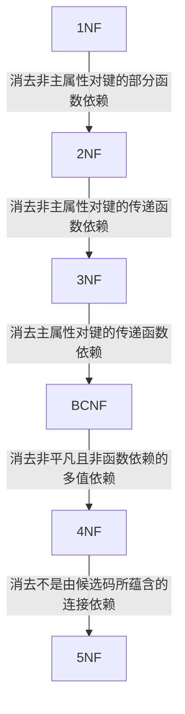

::: details 参考

1. [数据库规范化 - Wikipedia](https://zh.wikipedia.org/wiki/%E6%95%B0%E6%8D%AE%E5%BA%93%E8%A7%84%E8%8C%83%E5%8C%96)
2. [第一范式 - Wikipedia](https://zh.wikipedia.org/wiki/%E7%AC%AC%E4%B8%80%E6%AD%A3%E8%A6%8F%E5%8C%96)
3. [第二范式 - Wikipedia](https://zh.wikipedia.org/wiki/%E7%AC%AC%E4%BA%8C%E6%AD%A3%E8%A6%8F%E5%8C%96)
4. [第三范式 - Wikipedia](https://zh.wikipedia.org/wiki/%E7%AC%AC%E4%B8%89%E6%AD%A3%E8%A6%8F%E5%8C%96)
5. [BC范式 - Wikipedia](https://zh.wikipedia.org/wiki/BC%E6%AD%A3%E8%A6%8F%E5%BD%A2%E5%BC%8F)
6. [数据库六种范式详解（1NF/2NF/3NF/BCNF/4NF/5NF）](https://zgcr.gitlab.io/2019/06/23/shu-ju-ku-liu-chong-fan-shi-xiang-jie-1nf-2nf-3nf-bcnf-4nf-5nf/)
7. [数据库范式（1NF 2NF 3NF BCNF）详解](https://www.jianshu.com/p/a78faaf59e49)
8. [BCNF和第三范式的分解算法](https://blog.csdn.net/weixin_44959377/article/details/103634963)
9. [BCNF范式的判断和分解](https://codeantenna.com/a/QNdsSoFocn)
10. [数据库中的范式和多值依赖](https://blog.csdn.net/legendaryhaha/article/details/80032808)
11. [50.关系模式R(U)中, X.Y.Z是U的子集. 下列关于多值依赖描述中正确的是](https://blog.51cto.com/u_7197299/2553363)
12. [第五范式 - Wikipedia](https://zh.wikipedia.org/wiki/%E7%AC%AC%E4%BA%94%E8%8C%83%E5%BC%8F)
13. [Join dependency - Wikipedia](https://en.wikipedia.org/wiki/Join_dependency)
14. [Lossless join decomposition - Wikipedia](https://en.wikipedia.org/wiki/Lossless_join_decomposition)

:::

## 前置知识

::: info 定义

**数据库规范化**, 又称**正规化**、**标准化**, 是数据库设计的一系列原理和技术, 以减少数据库中数据冗余, 增进数据的一致性. 

:::

### 关系规范化

**规范化**指关系模式调优的一种机制, 其以关系模式中的数据依赖为出发点, 采用关系模式分解等措施, 消除关系模式中不合适的数据依赖, 达到解决数据的插入异常、删除异常、更新异常和数据冗余等问题的目标. 

### 函数依赖

如果$R$的两个元组在属性$A_1, A_2, \dots, A_n$上一致, 那么必在$B_1, B_2, \dots, B_m$上也一致, 称为: $A_i$函数决定$B_j$, 形式化记作:
$$
A_1, A_2, \dots, A_n\rightarrow B_1, B_2, \dots, B_m
$$

::: tip 函数依赖与属性关系

设$R(U)$是属性集$U$上的关系模式, $X, Y$是$U$的子集: 
 - 如果$X$和$Y$之间是$1:1$关系, 则存在函数依赖$X\rightarrow Y$和$Y\rightarrow X$, 记为$X\leftrightarrow Y$.
 - 如果X和Y之间是$1:n$关系, 则存在函数依赖$Y\rightarrow X$.
 - 如果X和Y之间是$m:n$关系, 则X和Y之间不存在函数依赖. 

:::

如果对于关系$R$中每个实例使得一个给定的$F_D$为真, 则称$R$满足函数依赖$F$.

**平凡的函数依赖**: 给定关系模式$R(U)$, $X$和$Y$是$U$的子集, 若$X\rightarrow Y$, 且$Y\subseteq X$, 则称$X\rightarrow Y$是平凡的函数依赖.

**非平凡函数依赖**: 给定关系模式$R(U)$, $X$和$Y$是$U$的子集, 若$X\rightarrow Y$, 且$Y\not\subseteq X$, 则称$X\rightarrow Y$是非平凡的函数依赖.

::: tip

若$X\rightarrow Y$, 则称$X$为这个函数依赖的决定属性(组), 或决定因素.

若$Y$不函数依赖于$X$, 则记作$X\not\rightarrow Y$.

:::

**完全函数依赖**: 给定关系模式$R(U, F)$, $X\rightarrow Y\in F$, 若$\forall X^\prime \subsetneq X$, 均有$X^\prime \not\rightarrow Y$, 则称$Y$对$X$完全函数依赖, 记为$X\stackrel{F}{\rightarrow}Y$.

**部分函数依赖**: 给定关系模式$R(U, F)$, $X\rightarrow Y\in F$, 若$\exists X^\prime \subsetneq X$, 且$X^\prime \rightarrow Y$, 则称$Y$不完全函数依赖于$X$, 或$Y$对$X$部分函数依赖, 记为$X\stackrel{P}{\rightarrow}Y$.

**传递函数依赖**: 给定关系模式$R(U, F)$, 若$X\rightarrow Y\in F$, 且$Y\not\subseteq X, Y\not\rightarrow X$, 并且$Y\rightarrow Z, Z\not\subseteq Y$, 则称$Z$对$X$传递函数依赖, 记为$X\stackrel{\text{传递}}{\longrightarrow}Z$

::: tip 注意

若$X\rightarrow Y$且$Y\rightarrow X$, 则有$X\leftrightarrow Y$, 则称$Z$直接依赖于$X$.

:::

### 超键

如果关系$R$的属性集$T=\{ A_1, A_2, \dots, A_n \}$是键, 则必须满足:
1. 这些属性函数决定关系中所有其他属性;
2. 在$T$的所有真子集中, 没有一个可以函数决定$R$的其他属性. 也就是说, 键是最小属性集且函数决定其他属性.

若一个属性集仅满足条件一, 而不满足条件二, 则该属性集称为超键. 若一个关系中有多个键, 则要指定其中一个作为主键.

### 候选码求取

闭包的概念其实各领域基本通用, 要求都是一样的, 包内各元素通过运算符计算得出的结果仍然在包内, 详细的理论可去参考离散数学的代数系统部分.

基于闭包的概念, 如果有某些个属性可以推知其他所有属性, 那么显然这些属性是关键的, 通过闭包运算即可得知某属性集是否为该关系的候选码.

### 候选键求取理论

对于给定的关系$R(A_1, A_2, \dots, A_n)$和函数依赖集$F$, 可将其属性分为4类:
1. L类: 仅出现在函数依赖左部的属性
2. R类: 仅出现在函数依赖右部的属性
3. N类: 在函数依赖左右两边均未出现的属性
4. LR类: 在函数依赖左右两边均出现的属性

**定理**: 
1. 对于给定的关系模式$R$及其函数依赖集$F$, 若$X(X\in R)$是L类属性, 则$X$必为$R$的任一候选码的成员. 
2. 对于给定的关系模式$R$及其函数依赖集$F$, 若$X(X\in R)$是R类属性, 则$X$不在任何候选码中.
3. 对于给定的关系模式$R$及其函数依赖集$F$, 若$X(X\in R)$是N类属性, 则$X$必包含在$R$的任一候选码中. 

**推论**: 
1. 对于给定的关系模式$R$及其函数依赖集$F$, 若$X(X\in R)$是L类属性, 且$X^+$包含了$R$的全部属性；则$X$必为$R$的唯一候选码. 
2. 对于给定的关系模式$R$及其函数依赖集$F$, 若$X(X\in R)$是L类和N类组成的属性集, 且$X^+$包含了$R$的全部属性；则$X$是$R$的唯一候选码.

## 范式

若关系模式$R$符合第$n$范式的约定规则, 则可表示为$R\in n\mathrm{NF}$.

通过模式分解等方法, 将一个属于低级别范式的关系模式转换为若干个属于高级别范式的关系模式的集合, 这种过程即**规范化**.

## 第一范式

**第一范式**（1NF）是数据库正规化所使用的正规形式. 第一范式是为了要排除重复组的出现, 要求: 

 - 数据库的每一列的论域都是由不可分割的原子值组成. 
 - 每个字段的值都只能是单一值.

若满足以上条件, 则$R\in n\mathrm{NF}$.

::: warning

1NF是对关系模式的基本要求, 不满足第一范式的数据库模式不能称为关系数据库.

:::

## 第二范式

**第二范式**（2NF）是数据库正规化所使用的正规形式. 规则是要求资料表里的所有资料都要和该资料表的键（主键与候选键）有完全依赖关系：每个非键属性必须独立于任意一个候选键的任意一部分属性. 

一个资料表符合第二范式当且仅当:
 - $R\in 1\mathrm{NF}$.
 - 所有非键字段都不能是候选键非全体字段的函数, 即每一个非主属性完全函数依赖于码.

::: details 分解算法

(这里是施工现场, 我正在填坑了, 您先等等, 别着急......ToT)

:::

## 第三范式

**简洁定义**: 对于每个非平凡FD(函数依赖), 或者左边是超键, 或者右边仅由主属性构成.

**第三范式**(3NF)是数据库正规化所使用的正规形式, 要求所有非主键属性都只和候选键有相关性, 也就是说非主键属性之间应该是独立无关的. 

::: details 分解算法

(这里是施工现场, 我正在填坑了, 您先等等, 别着急......ToT)

:::

::: details 证明例题

求证: 若$R\in 3\mathrm{NF}$, 则每一个非主属性既不部分依赖于码也不传递依赖于码.

**(1) 关于对码的传递函数依赖**

假设存在对码的传递函数依赖, 则必有: $\exists$属性组$P, S$及$T$, 其中$P$是码, 满足$P\rightarrow S, S\rightarrow T, S\not\rightarrow P, T\not\subseteq S$, 与3NF的定义相违背, 假设不成立.

**(2) 关于对码的部分函数依赖**

若存在对码的部分函数依赖, 则必有: $\exists$属性组$P, Q$及$S$, 其中$P$是码, $Q\subsetneq P, S\not\subseteq Q$, 满足$Q\rightarrow S$, 则有$P\rightarrow Q, Q\rightarrow S, Q\not\rightarrow P$, 与3NF的定义相违背, 假设不成立. 

:::

## 巴斯范式(Boyce-Codd Normal Form, BCNF)

定义: 如果对于关系模式R中存在的任意一个非平凡函数依赖$X\rightarrow A$, 都满足X是R的一个超键, 那么关系模式R就属于BCNF. 

形式化定义: 关系模式$R<U, F> \in 1\mathrm{NF}$, 对$F$中的每一个非平凡函数依赖, $X\rightarrow Y(Y\not\subseteq X)$, 若$X$必含有码, 则称$R<U,F>\in \mathrm{BCNF}$.

等价语义: 属于BCNF的关系模式, 每个非平凡依赖的左边必须包括侯选建. 

若$R\in \mathrm{BCNF}$:
 - R中所有非主属性对每一个码都是完全函数依赖.
 - R中所有主属性对每一个不包含它的码也是完全函数依赖.
 - R中不存在任何属性完全函数依赖于非码的一组属性.

::: details 分解算法

(这里是施工现场, 我正在填坑了, 您先等等, 别着急......ToT)

:::

## 数据依赖的公理系统(Armstrong公理系统)

(这里是施工现场, 我正在填坑了, 您先等等, 别着急......ToT)

## 模式分解

(这里是施工现场, 我正在填坑了, 您先等等, 别着急......ToT)

## 第四范式

::: info 多值依赖

**设计的目的**: 尽量消除插入、删除异常, 修改复杂, 数据冗余.

**定义**: 

设$R(U)$是一个属性集$U$上的一个关系模式,  $X, Y$和$Z$是$U$的子集, 并且$Z＝U－X－Y$. 关系模式$R(U)$中多值依赖$X↠Y$成立, 当且仅当对$R(U)$的任一关系$r$, 给定的一对$(x, z)$值, 有一组$Y$的值, 这组值仅仅决定于$x$值而与$z$值无关. 

在关系模式中, 函数依赖不能表示属性值之间的一对多联系, 这些属性之间有些虽然没有直接关系, 但存在间接的关系, 把没有直接联系、但有间接的联系称为多值依赖的数据依赖. 

**判定方法**: 对于任意关系中, 如果存在两个元组(就是行), 记为$A, B$, 如果他们的某一属性$X$的值相等, 那么我们交换它们另外的属性$Y$的值后, 得到的新的两个元组, 在表中仍可以在原来的表中找到与它们相匹配的元组. 

:::

**平凡多值依赖和非平凡的多值依赖**: 

若$X↠Y$, 而$Z＝\varnothing$, 则称$X↠Y$为平凡的多值依赖, 否则称$X↠Y$为非平凡的多值依赖. 

**多值依赖与函数依赖的区别**:

函数依赖是多值依赖的一种特殊情况, 根据定义中的"有一组$Y$的值", 我们可以令这一组$Y$内只含有一个元素$Y^*$, 这时就是函数依赖.

因此我们认为函数依赖一定是多值依赖, 多值依赖是函数依赖的超集.

**多值依赖的性质**:

1. 对称性: 若$X↠Y$, 则$X↠Z$, 其中$Z=U-X-Y$.
2. 传递性: 若$X↠Y, Y↠Z$, 则$X↠Z-Y$.
3. 函数依赖是多值依赖的特殊情况: 若$X\rightarrowY$, 则$X↠Y$.
4. 若$X↠Y, X↠Z$, 则$X↠Y\cup Z$.
5. 若$X↠Y, X↠Z$, 则$X↠Y\cap Z$.
6. 若$X↠Y, X↠Z$, 则$X↠Y-Z, X↠Z-Y$.

总之, 第四范式的要求有以下三点:
1. 不允许有非平凡且非函数依赖的多值依赖.
2. 允许的非平凡多值依赖是函数依赖.
3. 平凡的多值依赖属于第四范式.

## 第五范式

关系数据库设计的第五范式($5\mathrm{NF}$), 也称投影-连接范式（Project-join Normal Form, PJ/NF）是数据库规范化的一个级别，以去除多个关系之间的语义相关. 

**定义**: 一张表满足第五范式**当且仅当**它的每个连接依赖可由候选键推出. $R$连接依赖于$\,^*\{A, B, \dots , Z\}$，定义为$A, B, \dots , Z$都是$R$的属性的子集, 且$A, B, \dots , Z$的连接(Join)等于$R$。$R$上的连接依赖$\,^*\{A, B, \dots , Z\}$可由$R$的候选键推出，当且仅当$A, B, \dots , Z$的每一个都包含了R的超键. 

::: info 连接依赖

Wikipedia上没有中文词条的解释, 能找到的只有英文版的:

> In the area of computer science known as dependency theory, a join dependency is a constraint on the set of legal relations over a database scheme. A table $T$ is subject to a join dependency if $T$ can always be recreated by joining multiple tables each having a subset of the attributes of $T$. If one of the tables in the join has all the attributes of the table $T$, the join dependency is called trivial.
> 
> The join dependency plays an important role in the Fifth normal form, also known as project-join normal form, because it can be proven that if a scheme $R$ is decomposed in tables $R_{1}$ to $R_{n}$, the decomposition will be a lossless-join decomposition if the legal relations on $R$ are restricted to a join dependency on $R$ called $\,^*(R_{1},R_{2},\ldots ,R_{n})$.

不过英文版解释的也比较清晰, 我想在这里应该不用再做赘述了.

:::

## 总结

::: tip 以上各范式之间的联系

$$
\mathrm{BCNF}\subseteq\mathrm{3NF}\subseteq\mathrm{2NF}\subseteq\mathrm{1NF}
$$

:::