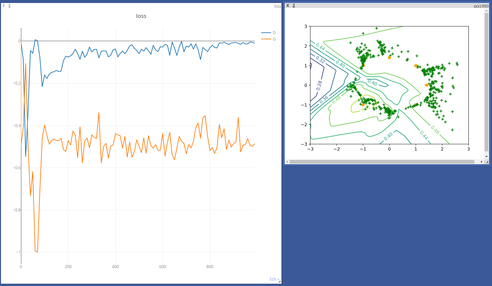
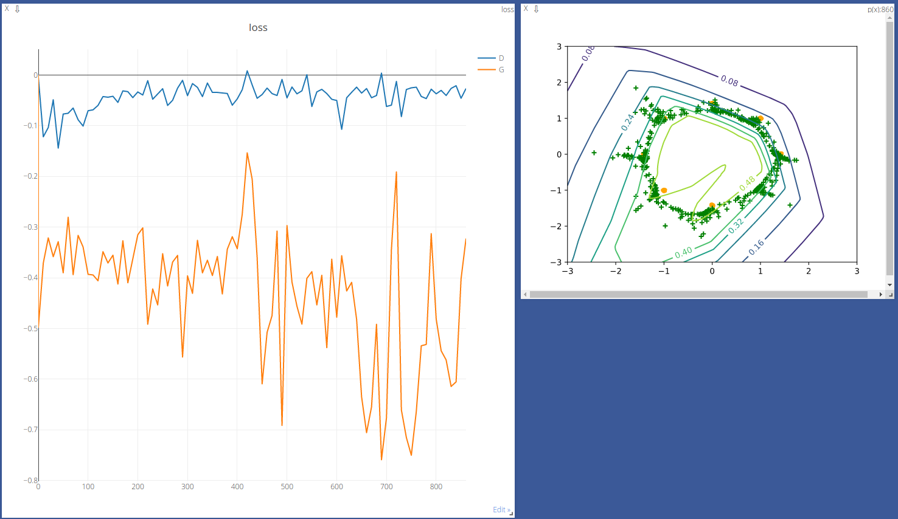
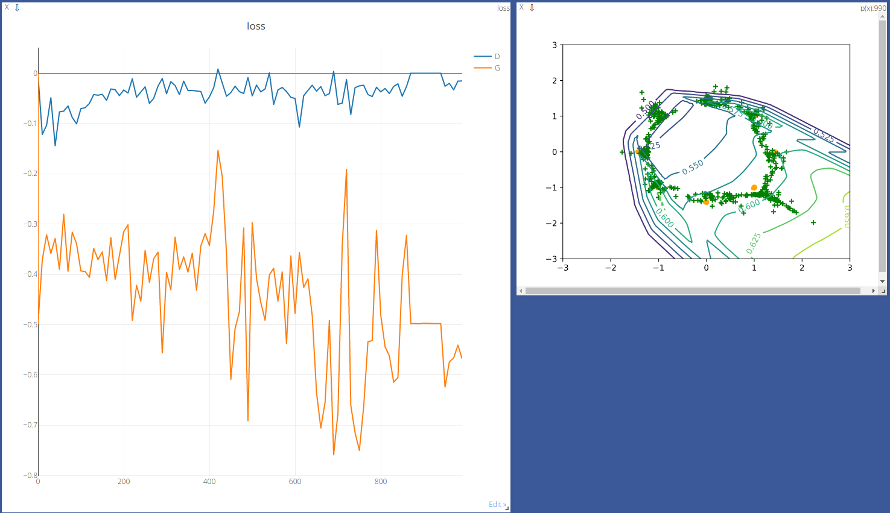
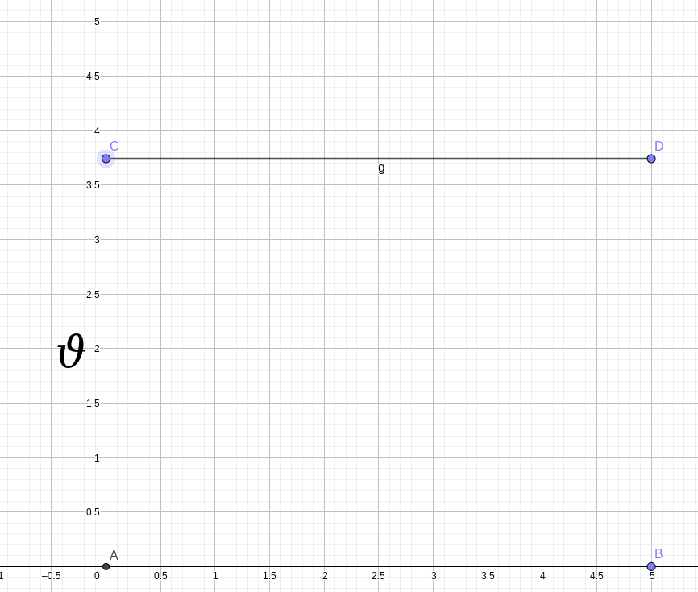

::: info 参考资料

首推这篇博客，本文内容多参考自此。[WGAN (原理解析)](https://www.cnblogs.com/Allen-rg/p/10305125.html)
本文也另外参考了这篇[博客](https://lotabout.me/2018/WGAN/)

:::

## 结果

尽管表现差了些，但也比之前的 Standard GAN 要强多了。虽然这里出现了训练不稳定的情况，但还不至于直接导致梯度消失的问题。







从最终结果来看，成绩还没那么糟糕，较多数的点也聚集在黄点的区域附近了。

## 原因

### 原始GAN的缺陷

***通俗的解释就是，判别器训练的太好，以至于生成器训练不动！***

我们先来看一下 Standard GAN 的损失函数：
$$
L(G,D)=2D_{JS}(P_r||P_g)-2log2
$$
为避免你遗忘，再复习一下这两个定义：
$$
D_{KL}(p||q)=\int_x p(x)log\frac{p(x)}{q(x)}dx
$$

$$
D_{JS}= \frac{1}{2}D_{KL}(p||\frac{p+q}{2})+\frac{1}{2}D_{KL}(q||\frac{p+q}{2})
$$

根据前一篇的推导，我们可以看到，如果我们能缩小这个 JS 散度的话，就可以把真实分布和生成分布拉近了，而这正是我们希望看到的，生成器生成的东西会更接近真实。

**然而现实总是残酷的，问题就出现在这个JS散度上。** 我们对它的希望只能在两个分布有所重叠且重叠部分不可忽略的情况下才能成立。反过来说就是，如果两个分布没有重叠或者有可忽略的重叠，JS散度的结果只能是一个常数（ $\lg2$，可自行验证），而常数意味着梯度必然为0！

我们试着探究一下，对于任意一个连续随机变量$x$，必然分如下四种情况：

$$
P_1(x)=0\wedge P_2(x)=0\text{；}P_1(x)\not=0\wedge P_2(x)\not=0\text{；} \newline
P_1(x)\not=0\wedge P_2(x)=0\text{；}P_1(x)=0\wedge P_2(x)\not=0\text{；}
$$

对于第一种情况是对JS散度无贡献的；而第二种情况又因为重叠部分可忽略以至于贡献过小，也可看作无贡献；而对于后两种情况，计算结果皆为$\lg2$。

而真实分布和生成分布不重叠或者重叠部分可忽略的情况出现的可能性有多大？可以说非常大。而严格来说，则是当$P_r$和$P_g$的**支撑集**是高维空间中的低维**流形**时$P_r$和$P_g$重叠部分**测度**为0的概率为1。

::: tip

**支撑集**: 指的是函数的非零部分子集。一个概率分布的支撑集就是所有概率密度非零部分的集合。可以和函数的定义域或者命题的论域等做类比理解。
**流形**: 是高维空间中曲线、曲面概念的拓广，比如在三维空间中任一曲面都是二维流形，任一曲线是一维流形。
**测度**: 是高维空间中长度、面积、体积概念的推广，在这里可以大致理解为超体积。

:::

现在，我们再想，一般生成器都是从低维空间中随机生成某一编码向量，再通过神经网络生成高维数据，然而尽管最后数据是高维的，可实质上的维度还是和编码向量维度相同或者比编码向量维度还小（考虑到神经网络带来的映射降维）——因为向量的所有变化都只能分布在低维空间中，而所有的变化又与高维数据形成映射，也就是说，高维空间中的事件空间仅含有低维空间内的所有变化，而不包含高维空间的其余部分。「这就是这位博主说的“撑不满”整个高维空间的意思。」

正是有上面的“撑不满”的问题，真实分布和生成分布就很难有重叠部分，首先要明白，我们寻找的重叠部分实际上是和真实分布、生成分布同维的，那么在整个高维空间中，两个分布即使能相交，得到的重叠部分只能是低维流形，这对于我们要找到的重叠部分而言差的很远，测度显然为 0（可能没有测度，也可能测度过小而可忽略）。

综上所述，在（近似）最优判别器中，最小化生成器$L(G,D)$等价于最小化$P_r$和$P_g$的JS散度，然而当$P_r$和$P_g$不重叠或者重叠部分测度为 0 时，无论两个分布相距多远，JS 散度始终是$\lg2$，导致梯度几乎为0，梯度消失，生成器就无法训练。

而我们再宏观把握这个问题：

1.由于$P_r$和$P_g$几乎不能有不可忽略的重叠，不论两者实际的距离有多小，必然存在一个最优分割曲面能恰好将两者隔开，而且仅仅是那些测度为0的重叠部分不能被隔开。

2.以神经网络为主体的判别器可无限拟合上面提到的曲面，从而能够出现这样一个最优判别器，对几乎整个真实分布给出概率为1，而对几乎整个生成分布给出概率为 0，而只有那些可忽略的测度为 0 的部分，最优判别器才不能很好地分类。

3.判别器对真实分布和生成分布的概率是常数，这造成生成器损失函数的梯度变成0。

这下就清楚原始 GAN 的问题所在了：如果判别器训练得太好，生成器的梯度就消失，Loss 函数无法下降；如果判别器训练得不好，生成器梯度不准，会生成许多无用的样本。只有将判别器训练得恰到好处才能表现良好，然而这一点非常难做到，像博主所说，“在同一轮训练的前后不同阶段这个火候都可能不一样”，因此原始GAN非常难训练。

后来 Ian Goodfellow 提出了一种改进方式，将生成器的 Loss 改成$\mathbb{E}_{x\sim }[-\log D(x)]$，然后将 KL 散度变换成含判别器 D 的形式：

$$
\begin{align*}
KL(P_g||P_r) &=\mathbb{E}_{x \sim P_g}[\log \cfrac{P_g(x)}{P_r(x)}] \\
&=\mathbb{E}_{x \sim P_g}[\log \frac{\cfrac{P_g(x)}{P_r(x)+P_g(x)}}{\cfrac{P_r(x)}{P_r(x)+(x)}}] \\
&=\mathbb{E}_{x \sim P_g}[\log \cfrac{1-D(x)}{D(x)}] \\
&=\mathbb{E}_{x \sim P_g}\log[1-D(x)]-\mathbb{E}_{x \sim P_g}\log D(x)
\end{align*}
$$

$$
\begin{align*}
\mathbb{E}_{x\sim P_g}[-\log D(x)]&=KL(P_g||P_r)-\mathbb{E}_{x \sim P_g}\log[1-D(x)]\\
&=KL(P_g||P_r)-2JS(P_r||P_g)+2\log2+\mathbb{E}_{x \sim P_r}\log D(x)
\end{align*}
$$

很容易看出来最后两项不依赖生成器，因而最小化该公式就等价于最小化$KL(P_g||P_r)-2JS(P_r||P_g)$，但很明显，这是在同时做两件相互矛盾的事——既要最小化 KL 散度，又要最大化 JS 散度（回顾之前的 Standard GAN 可知，JS 本身就是在以 KL 散度来定义）。尽管构成了博弈关系，但最后导致了梯度不稳定。

另外，前面的 KL 散度项也存在问题，因为 KL 散度本身不是对称的衡量，$KL(P_g||P_r)$和$KL(P_r||P_g)$是有区别的，为什么要提及不对称的问题？我们看一下关于$KL(P_g||P_r)$的两种情况：

当$P_g(x)\to 0,P_r(x)\to 1$时，$P_g(x)\log\frac{P_g(x)}{P_r(x)}\to0$，对$KL(P_g||P_r)$的贡献趋近于0；

当$P_g(x)\to 1,P_r(x)\to 0$时，$P_g(x)\log\frac{P_g(x)}{P_r(x)}\to +\infty$，对$KL(P_g||P_r)$的贡献趋近于正无穷。

这代表了惩罚失衡。对于第一种情况，生成器没能生成真实的样本，惩罚却微小，而对于第二种情况，生成器生成了不真实的样本，惩罚却巨大。这样会导致生成器宁可生成重复但不会错的样本，也不会去生成多样的样本，而这就是常见的**Collapse Mode**。

### WGAN前作的改进

WGAN前作针对生成器随机初始化后的生成分布很难与真实分布有不可忽略的重叠的问题提出了一种解决方案：向生成样本和真实样本添加噪声。这样就让原本的两个低维流形强行弥散到整个高维空间，从而使两者产生不可忽略的重叠。

显然一旦存在重叠，JS 散度就可以发挥作用，当两个分布靠近的时候，JS 散度也会减小，而不再是恒为常数了，这样就可以解决生成器梯度消失问题了。训练过程中还可以对添加的噪声进行退火，缓慢减小其方差，直到最后两个低维流体已经有不可忽略的重叠的时候把噪声完全拿掉，JS 也能正常发挥作用，继续拉近两个低维流形，直到他们接近完全重合为止。

采取这样的方案后，对原来的损失函数
$$
\mathbb{E}_{x\sim P_r(x)}[\log D(x)]+\mathbb{E}_{x\sim P_g(x)}[\log(1-D(x))]=2JS(P_r||P_g)-2\log2
$$
取反可得判别器最小 loss 为

$$
\min L_D(P_{r+\epsilon},P_{g+\epsilon})=-\mathbb{E}_{x\sim P_{r+\epsilon}}[\log D(x)]-\mathbb{E}_{x\sim P_{g+\epsilon}}[\log(1-D(x))]
$$

### WGAN 出现的全过程

::: info 参考资料

- [一致连续和连续的区别：整体性质与局部性质 - CSDN](https://blog.csdn.net/weixin_50907960/article/details/132844942)
- [函数的一致连续性专题 - 知乎](https://zhuanlan.zhihu.com/p/403881218)
- [如何通俗的解释函数的一致连续性？ - 知乎](https://zhuanlan.zhihu.com/p/87515532)
- [一致连续 - 维基百科](https://zh.wikipedia.org/wiki/%E4%B8%80%E8%87%B4%E8%BF%9E%E7%BB%AD)
- [利普希茨连续 - 维基百科](https://zh.wikipedia.org/wiki/%E5%88%A9%E6%99%AE%E5%B8%8C%E8%8C%A8%E9%80%A3%E7%BA%8C)
- [WGAN (原理解析)](https://www.cnblogs.com/Allen-rg/p/10305125.html)

:::

在这里就要引入一个新的概念：Wasserstein 距离（又称 Earth-Mover 距离、 EM 距离），定义如下：
$$
W(P_r,P_g)=\underset{\gamma\sim\Pi(P_r,P_g)}{inf}\mathbb{E}_{(x,y)\sim\gamma}[||x-y||]
$$
其中$\Pi(P_r,)$是$P_r$和$P_g$组合起来的所有可能的联合分布集合，显然，其边缘分布为$P_r$和$P_g$。又由于对每一个可能的联合分布$\gamma$而言，总可以从$\Pi(P_r,)$中采样$(x, y)\sim\gamma$得到一个真实样本$x$和生成样本$y$，并算出这两个样本的距离$||x-y||$，就可以借此算出该联合分布$\gamma$下样本对距离的期望值$E_{(x,y)\sim\gamma}[||x-y||]$，在所有可能的联合分布中取到这些期望值的下界$\underset{\gamma\sim\Pi(P_r,P_g)}{inf}\mathbb{E}_{(x,y)\sim\gamma}[||x-y||]$，这个下界就被定义为 Wasserstein 距离。

这里直接引用博主的解释，博主的讲解还是比较准确的：
> 直观上可以把$\mathbb{E}_{(x,y)\sim\gamma}[||x - y||]$理解为在$\gamma$这个“路径规划”下把$P_r$这堆“沙土”挪到$P_g$“位置”所需的“消耗”，而$W(P_r, P_g)$就是“最优路径规划”下的“最小消耗”，所以才叫 Earth-Mover（推土机）距离。

Wasserstein 距离相比 KL 散度和 JS 散度的优势在于，即使真实分布和生成分布没有任何重叠，Wasserstein 距离仍然能够反映它们的远近程度。下面我们来做一个平行比较：



其中$P_1$表示在线段 AB 上的分布，$P_2$表示在线段 CD 上的分布
$$
KL(P_1||P_2)=
\begin{cases}
+\infty \qquad if \,\, \vartheta \neq 0\\
0 \qquad\quad\,\, if \,\, \vartheta = 0
\end{cases}
$$

$$
JS(P_1||P_2)=
\begin{cases}
+\infty \qquad if \,\, \vartheta \neq 0 \\
0 \qquad\quad\,\, if \,\, \vartheta = 0
\end{cases}
$$

$$
W(P_1,P_2)=|\vartheta|
$$
从中我们不难发现，KL 散度、JS 散度在$\vartheta=0$附近发生突变，这意味着在$\vartheta=0$处不可导，因而不可能存在梯度，更谈何下降？

那么我们理解 Wasserstein 距离之后，该如何构建 GAN 网络模型呢？将它定义为生成器的 Loss 函数，产生有意义的梯度，从而将生成分布拉向真实分布吗？然而我们回看这个定义，会发现如果要求解$\underset{\gamma\sim\Pi(P_r,)}{inf}$的话，按照定义我们应该把每一个期望值都算出来，然后去寻找下界。很明显这效率不高，也几乎无法实现。不过作者用了一系列定理得出一套能使用的公式：
$$
W(P_r, ) = \frac{1}{K} \sup_{||f||_L \leq K} \mathbb{E}_{x \sim P_r} [f(x)] - \mathbb{E}_{x \sim P_g} [f(x)]
$$
具体过程请去查阅[相关论文](https://arxiv.org/abs/1701.07875)的附录C。

在进一步解释这个公式之前，我们需要知道利普希茨连续（Lipschitz Continuity）的概念。

::: info 利普希茨连续

对于在实数集的子集的函数${\displaystyle f\colon D\subseteq \mathbb {R} \to \mathbb {R} }$，若存在常数${\displaystyle K}$，使得$|f(a)-f(b)|\leq K|a-b|\quad \forall a,b\in D$，则称${\displaystyle f}$符合利普希茨条件，对于$f$最小的常数${\displaystyle K}$称为${\displaystyle f}$的利普希茨常数。

若$K<1$，$f$称为收缩映射。

利普希茨条件也可对任意度量空间的函数定义：

给定两个度量空间$(M,d_{M}),(N,d_{N}),U\subseteq M$。若对于函数$f:U\to N$，存在常数$K$使得$d_{N}(f(a),f(b))\leq Kd_{M}(a,b)\quad \forall a,b\in U$
则说它符合利普希茨条件。

若存在$K\geq 1$使得${\frac{1}{K}}d_{M}(a,b)\leq d_{N}(f(a),f(b))\leq Kd_{M}(a,b)\quad \forall a,b\in U$
则称$f$为**双利普希茨**(bi-Lipschitz)。

::: right
——摘自[维基百科 - 利普希茨连续](https://zh.wikipedia.org/wiki/%E5%88%A9%E6%99%AE%E5%B8%8C%E8%8C%A8%E9%80%A3%E7%BA%8C)
:::

::: warning 满足 Lipschitz 连续条件的函数$f$是否连续？

**连续**的定义：
$$
\forall x,\varepsilon (\varepsilon > 0), \exist \delta>0, \text{使得当} |x-x_0|<\delta\text{时，都有}|f(x)-f(x_0)| < \varepsilon.
$$
**一致连续**的定义：
$$
\forall \varepsilon > 0, \exist \delta > 0, \text{使得} \forall x, x_0, \text{当}|x-x_0|<\delta\text{时，都有}|f(x)-f(x_0)|<\varepsilon
$$

则有

$\text{已知}f(x)\text{满足利普希茨连续条件}:$
$$
\because\forall x,x_0\in D_f, \exists K\text{使得}|f(x)-f(x_0)|\leq K|x-x_0| \\
\text{又}\because \exist \delta > 0\text{使得} |x-x_0|<\delta \Rightarrow |f(x)-f(x_0)| < K\delta \\
\text{不妨设} \varepsilon = K\delta, \text{则有} |f(x)-f(x_0)| < \varepsilon. \\
\therefore \text{函数}f\text{在}D_f\text{上一致连续，显然}f(x)\text{连续}. \\
$$
::: right
$\mathcal{Q.E.D.}$
:::

综合证明来看，Lipschitz 连续条件是一个比一致连续更强的光滑性条件，所以有下面博主的表述：

> 它其实就是在一个连续函数$f$上面额外施加了一个限制，要求存在一个常数$K\geq 0$使得定义域内的任意两个元素$x_1$和$x_2$都满足$|f(x_1) - f(x_2)| \leq K |x_1 - x_2|$，此时称函数f的 Lipschitz 常数为 K 。

我们再看下面的这个公式
$$
W(P_r, P_g) = \frac{1}{K} \sup_{||f||_L \leq K} \mathbb{E}_{x \sim P_r} [f(x)] - \mathbb{E}_{x \sim P_g} [f(x)] \quad\quad(A)
$$
在要求$||f||_L \leq K$的条件下对所有可能满足条件的$f$取到$\mathbb{E}_{x \sim P_r} [f(x)] - \mathbb{E}_{x \sim P_g} [f(x)]$的上界，再缩小K倍。

如果存在某函数$f_\omega$，这函数由$\omega$个参数确定，则 (A) 式可以写成：
$$
W(P_r, P_g) \approx \frac{1}{K} \max_{\omega|f_\omega|_L \leq K} \mathbb{E}_{x \sim P_r} [f_\omega(x)] - \mathbb{E}_{x \sim P_g} [f_\omega(x)] \quad \quad (B)
$$
这样定义出来的函数虽然不能囊括所有可能，至少可以足够接近我们希望求得的原式。那么如何得到上面提到的函数？「由$\omega$个参数确定」不觉得熟悉吗？这个其实就可以用神经网络模型来拟合。那么就可以在 (B) 式的基础上定义Loss函数了，只要能寻找出上界就可以，由于我们只有梯度下降求解器，我们需要适当使用图形变换技巧转化一下 (B) 式，比如取其相反数。

最后还不能忘记公式的前提条件$||f||_L \leq K$，当然，$K$究竟有多大这无关紧要「不是无穷大就行」，因为我们只是需要梯度的方向。那么如何满足这个条件？作者采取的做法是始终将神经网络内的参数$\omega_i$限制在闭区间$[-c,c]$，这样关于输入样本$x$的导数就会被限制在确定的范围，至于到底是什么范围，就不是我们关心的了，有界就行。

现在我们构造一下判别器的损失函数。含参数$\omega$、最后一层不是非线性激活层的判别器网络$f_\omega$在限制$\omega$不超过某个范围的条件下，使
$$
L = \mathbb{E}_{x \sim P_r} [f_w(x)] - \mathbb{E}_{x \sim P_g} [f_w(x)]
$$
取到最大，此时$L$就会接近真实分布与生成分布之间的 Wasserstein 距离「忽略系数$K$」。

::: info 注意

Standard GAN 的判别器要做的是真假二分类任务，因此最后一层才会采用 sigmoid 函数处理，而现在WGAN的判别器做的是近似拟合 Wasserstein 距离，是回归问题，因此最后一层不使用非线性结构，要把 sigmoid 函数去掉。

:::

接着要与判别器博弈的生成器需要近似最小化 Wasserstein 距离，也就是最小化$L$，前面足够充分讨论了 Wasserstein 距离的优良性质，我们不用再担心会有梯度消失的问题。另外$L$的第一项只与判别器有关而与生成器无关，因此生成器的损失函数不含$\mathbb{E}_{x \sim P_r} [f_w(x)]$这一项「因为这一项会是常数」。

最终整个 WGAN 的两个 Loss 函数就构建完成了：
$$
\begin{align}
&\quad\quad L_G=-\mathbb{E}_{x\sim P_g}[f_w(x)]\\
&\quad\quad L_D=\mathbb{E}_{x\sim P_g} [f_w(x)]- \mathbb{E}_{x \sim P_r} [f_w(x)]
\end{align}
$$

## 实现

只消在 Standard GAN 代码的基础上再加上：

```python
def weights_init(m):
    if isinstance(m, nn.Linear):
        # m.weight.data.normal_(0.0, 0.02)
        nn.init.kaiming_normal_(m.weight)
        m.bias.data.fill_(0)
```

然后在main函数中初始化变量_clip为0.025「你也可以自己设定」，然后在声明的G和D后面插入两行代码：

```python
G.apply(weights_init)
D.apply(weights_init)
```

并在判别器训练的代码块后生成器训练的代码块之前添加如下代码：

```python
for w in D.parameters():
    w.data.clamp_(-_clip, _clip)
```

为了出现上面贴的图，我将后面的`if epoch %`后的数改成10，`for epoch in range`后括号内的数改成1000。

到此为止代码也就改完了，我们的WGAN也实现了！

完整代码请点这里查看$\rightarrow$[WGAN](https://github.com/BreezeShane/Unsupervised-Learning/blob/master/Wasserstein%20Generative%20Adversaria%20Networks.py)
