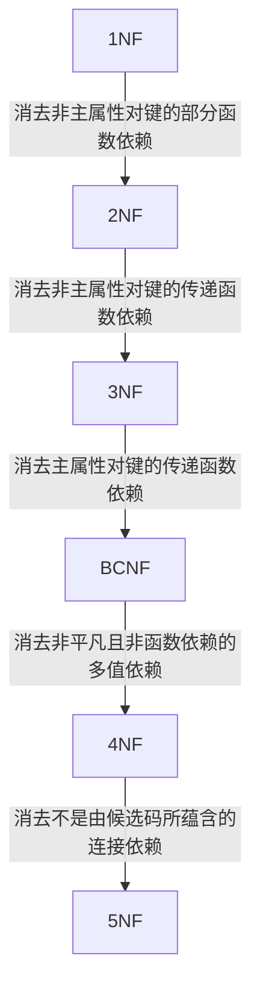

::: details 参考

1. [数据库规范化 - Wikipedia](https://zh.wikipedia.org/wiki/%E6%95%B0%E6%8D%AE%E5%BA%93%E8%A7%84%E8%8C%83%E5%8C%96)
2. [第一范式 - Wikipedia](https://zh.wikipedia.org/wiki/%E7%AC%AC%E4%B8%80%E6%AD%A3%E8%A6%8F%E5%8C%96)
3. [第二范式 - Wikipedia](https://zh.wikipedia.org/wiki/%E7%AC%AC%E4%BA%8C%E6%AD%A3%E8%A6%8F%E5%8C%96)
4. [第三范式 - Wikipedia](https://zh.wikipedia.org/wiki/%E7%AC%AC%E4%B8%89%E6%AD%A3%E8%A6%8F%E5%8C%96)
5. [BC范式 - Wikipedia](https://zh.wikipedia.org/wiki/BC%E6%AD%A3%E8%A6%8F%E5%BD%A2%E5%BC%8F)
6. [数据库六种范式详解（1NF/2NF/3NF/BCNF/4NF/5NF）](https://zgcr.gitlab.io/2019/06/23/shu-ju-ku-liu-chong-fan-shi-xiang-jie-1nf-2nf-3nf-bcnf-4nf-5nf/)
7. [数据库范式（1NF 2NF 3NF BCNF）详解](https://www.jianshu.com/p/a78faaf59e49)
8. [BCNF和第三范式的分解算法](https://blog.csdn.net/weixin_44959377/article/details/103634963)
9. [BCNF范式的判断和分解](https://codeantenna.com/a/QNdsSoFocn)
10. [数据库中的范式和多值依赖](https://blog.csdn.net/legendaryhaha/article/details/80032808)
11. [50.关系模式R(U)中, X.Y.Z是U的子集. 下列关于多值依赖描述中正确的是](https://blog.51cto.com/u_7197299/2553363)
12. [第五范式 - Wikipedia](https://zh.wikipedia.org/wiki/%E7%AC%AC%E4%BA%94%E8%8C%83%E5%BC%8F)
13. [Join dependency - Wikipedia](https://en.wikipedia.org/wiki/Join_dependency)
14. [Lossless join decomposition - Wikipedia](https://en.wikipedia.org/wiki/Lossless_join_decomposition)
15. [外键约束详解及术语释疑](https://blog.csdn.net/cnds123/article/details/39827049)
16. [关系型数据库的三类完整性约束](https://blog.csdn.net/weixin_44915226/article/details/105711836)
17. [数据库关系模型的三类完整性约束](https://blog.csdn.net/qq_32623363/article/details/87911560)
18. [关系数据模型要素三 关系完整性约束](https://owen027.github.io/2019/09/19/integrity_constraint_of_relational/)
19. [数据库系统的关系数据结构](https://kjhhhh.github.io/2021/03/07/%E6%95%B0%E6%8D%AE%E5%BA%93%E5%85%B3%E7%B3%BB%E6%95%B0%E6%8D%AE%E7%BB%93%E6%9E%84/)
20. [关系数据模型要素一 （关系数据结构）](https://owen027.github.io/2019/09/09/relation_data_model/)
21. [数据库学习--关系模式](https://segmentfault.com/a/1190000017295639)
22. [数据库中几个基本概念 主码 外码](https://blog.csdn.net/u014698348/article/details/46923587)
23. [数据库中的候选码、主码、全码、外码、主属性](https://blog.csdn.net/qq_35293120/article/details/105413418)
24. [关系代数 (数据库)](https://zh.wikipedia.org/wiki/%E5%85%B3%E7%B3%BB%E4%BB%A3%E6%95%B0_(%E6%95%B0%E6%8D%AE%E5%BA%93))
25. [利用SQL语言进行结果运算与聚集运算](https://www.csdn.net/tags/MtjacgwsODc0My1ibG9n.html)
26. [SQL——聚集函数](https://www.jianshu.com/p/5e1f9b8a2ec9)
27. [数据库常用关系代数符号在 LaTeX 中的表示](https://billc.io/2020/04/latex-relational-algebra/)
28. [数据库Schema模式的理解——模式与数据库的区别](https://blog.csdn.net/FallingU/article/details/78955707)
29. [聚集函数 - IBM](https://www.ibm.com/docs/zh/was/9.0.5?topic=language-aggregation-functions)
30. [数据库关系代数的聚集函数](https://blog.csdn.net/Gosick_Geass_Gate/article/details/85794100)
31. [第9讲：结果计算与聚集计算](cnblogs.com/xzxl/p/10742584.html)
32. [Tuple - Wikipedia](https://en.wikipedia.org/wiki/Tuple#Tuples_as_nested_ordered_pairs)
33. [MDX查询学习笔记1-元组和集合](https://blog.csdn.net/doiit/article/details/89068580)
34. [What does the term "Tuple" Mean in Relational Databases?](https://stackoverflow.com/questions/751264/what-does-the-term-tuple-mean-in-relational-databases)
35. [mondrian 源码解读（二）-MDX](https://sqtds.github.io/2014/10/26/2014/mondrian-source-code-2/)
36. [多维数据表达式MDX笔记](https://www.bianchengquan.com/article/359307.html)

:::

**数据库**，又称为数据管理系统，是以一定方式储存在一起、能予多个用户共享、具有尽可能小的冗余度、与应用程序彼此独立的数据集合。

## 分类

**关系型数据库**，是指采用了关系模型来组织数据的数据库，其以行和列的形式存储数据，以便于用户理解，关系型数据库这一系列的行和列被称为表，一组表组成了数据库。用户通过查询来检索数据库中的数据，而查询是一个用于限定数据库中某些区域的执行代码。

关系模型可以简单理解为二维表格模型，而一个关系型数据库就是由二维表及其之间的关系组成的一个数据组织。

::: details 关系型数据库特点

1. **存储方式**：传统的关系型数据库采用表格的储存方式，数据以行和列的方式进行存储，要读取和查询都十分方便。
2. **存储结构**：关系型数据库按照结构化的方法存储数据，每个数据表都必须对各个字段定义好（也就是先定义好表的结构），再根据表的结构存入数据，这样做的好处就是由于数据的形式和内容在存入数据之前就已经定义好了，所以整个数据表的可靠性和稳定性都比较高，但带来的问题就是一旦存入数据后，如果需要修改数据表的结构就会十分困难。
3. **存储规范**：关系型数据库为了避免重复、规范化数据以及充分利用好存储空间，把数据按照最小关系表的形式进行存储，这样数据管理的就可以变得很清晰、一目了然，当然这主要是一张数据表的情况。如果是多张表情况就不一样了，由于数据涉及到多张数据表，数据表之间存在着复杂的关系，随着数据表数量的增加，数据管理会越来越复杂。
4. **扩展方式**：由于关系型数据库将数据存储在数据表中，数据操作的瓶颈出现在多张数据表的操作中，而且数据表越多这个问题越严重，如果要缓解这个问题，只能提高处理能力，也就是选择速度更快性能更高的计算机，这样的方法虽然可以一定的拓展空间，但这样的拓展空间一定有非常有限的，也就是关系型数据库只具备纵向扩展能力。
5. **查询方式**：关系型数据库采用结构化查询语言（即SQL）来对数据库进行查询，SQL早已获得了各个数据库厂商的支持，成为数据库行业的标准，它能够支持数据库的CRUD（增加，查询，更新，删除）操作，具有非常强大的功能，SQL可以采用类似索引的方法来加快查询操作。
6. **规范化**：在数据库的设计开发过程中开发人员通常会面对同时需要对一个或者多个数据实体（包括数组、列表和嵌套数据）进行操作，这样在关系型数据库中，一个数据实体一般首先要分割成多个部分，然后再对分割的部分进行规范化，规范化以后再分别存入到多张关系型数据表中，这是一个复杂的过程。好消息是随着软件技术的发展，相当多的软件开发平台都提供一些简单的解决方法，例如，可以利用ORM层（也就是对象关系映射）来将数据库中对象模型映射到基于SQL的关系型数据库中去以及进行不同类型系统的数据之间的转换。
7. **事务性**：关系型数据库强调ACID规则（原子性（Atomicity）、一致性（Consistency）、隔离性（Isolation）、持久性（Durability）），可以满足对事务性要求较高或者需要进行复杂数据查询的数据操作，而且可以充分满足数据库操作的高性能和操作稳定性的要求。并且关系型数据库十分强调数据的强一致性，对于事务的操作有很好的支持。关系型数据库可以控制事务原子性细粒度，并且一旦操作有误或者有需要，可以马上回滚事务。
8. **读写性能**：关系型数据库十分强调数据的一致性，并为此降低读写性能付出了巨大的代价，虽然关系型数据库存储数据和处理数据的可靠性很不错，但一旦面对海量数据的处理的时候效率就会变得很差，特别是遇到高并发读写的时候性能就会下降的非常厉害。
9. **授权方式**：关系型数据库常见的有Oracle，SQLServer，DB2，Mysql，除了Mysql大多数的关系型数据库如果要使用都需要支付一笔价格高昂的费用，即使是免费的Mysql性能也受到了诸多的限制。

:::

非关系型数据库（NoSQL数据库）

1. **文档数据库**——这些数据库通常将每个键与称为文档的复杂数据结构配对。文档可以包含键数组对、键值对甚至嵌套文档。

   示例：MongoDB、Apache CouchDB、ArangoDB、Couchbase、Cosmos DB、IBM Domino、MarkLogic、OrientDB。
2. **键值存储**——每个单独的项都存储为键值对。键值存储是所有NoSQL数据库中最简单的数据库。

   示例：Redis,Memcached,Apache Ignite,Riak。
3. **宽列存储**——这些类型的数据库针对大型数据集上的查询进行了优化，它们将数据列存储在一起，而不是行。

   示例：Cassandra，Hbase，Scylla。
4. **图形存储**——这些存储关于图形、网络的信息，例如社会关系、路线图、交通链接。

   示例：Neo4j，AllegroGraph。

::: details 非关系型数据库特点

对于NoSQL并没有一个明确的范围和定义，但是他们都普遍存在下面一些共同特征：

1. **易扩展**：NoSQL数据库种类繁多，但是一个共同的特点都是去掉关系数据库的关系型特性。数据之间无关系，这样就非常容易扩展。无形之间，在架构的层面上带来了可扩展的能力。
2. **大数据量，高性能**：NoSQL数据库都具有非常高的读写性能，尤其在大数据量下，同样表现优秀。这得益于它的无关系性，数据库的结构简单。一般MySQL使用Query Cache。NoSQL的Cache是记录级的，是一种细粒度的Cache，所以NoSQL在这个层面上来说性能就要高很多。
3. **灵活的数据模型**：NoSQL无须事先为要存储的数据建立字段，随时可以存储自定义的数据格式。而在关系数据库里，增删字段是一件非常麻烦的事情。如果是非常大数据量的表，增加字段简直就是——个噩梦。这点在大数据量的Web 2.0时代尤其明显。
4. **高可用**：NoSQL在不太影响性能的情况，就可以方便地实现高可用的架构。比如Cassandra、HBase模型，通过复制模型也能实现高可用。

:::

::: tip

非关系型数据库的实质：非关系型数据库产品是传统关系型数据库的功能阉割版本，通过减少用不到或很少用的功能，来大幅度提高产品性能。

:::

## 关系型与非关系型数据库的比较

1. **成本**:Nosql数据库很容易部署，基本上是开源软件，无需像Oracle那样花费大量成本购买，比关系数据库便宜。
2. **查询速度**:Nosql数据库将数据存储在高速缓存中，不需要对SQL层进行分析。关系数据库在硬盘上存储数据，自然的查询速度远比Nosql数据库慢。
3. **存储数据的格式**：Nosql的存储格式是key,value形式、文档形式、图片形式等等，所以可以存储基础类型以及对象或者是集合等各种格式，而数据库则只支持基础类型。
4. **扩展性**：关系型数据库有类似join这样的多表查询机制的限制导致扩展很艰难。Nosql基于键值对，数据之间没有耦合性，所以非常容易水平扩展。
5. **持久存储**：Nosql不使用于持久存储，海量数据的持久存储，还是需要关系型数据库
6. **数据一致性**：非关系数据库通常强调数据的最终一致性，而不是像关系数据库那样强烈的数据一致性，以及从非关系数据库读取的数据可能仍处于中间状态，Nosql不提供对事务的处理。

## 特点

1. 数据结构化数据库系统实现整体数据的结构化，这是数据库的主要特征之一，也是数据库系统与文件系统的本质区别。
2. 数据的共享性高，冗余度低，易扩充数据库的数据不再面向某个应用而是面向整个系统，因此可以被多个用户、多个应用、用多种不同的语言共享使用。由于数据面向整个系统，是有结构的数据，不仅可以被多个应用共享使用，而且容易增加新的应用，这就使得数据库系统易于扩充，我们称之为弹性大。
3. 数据独立性高数据独立性包括数据的物理独立性和数据的逻辑独立性。数据库管理系统的模式结构和二级映像功能保证了数据库中的数据具有很高的物理独立性和逻辑独立性。
4. 数据由DBMS统一管理和控制数据库的共享是并发的共享，即多个用户可以同时存取数据库中的数据甚至可以同时存取数据库中同一个数据。为此，DBMS必须提供统一的数据控制功能，包括数据的安全性保护，数据的完整性检查，并发控制和数据库恢复。

## 作用

1. 实现数据共享：数据共享包含所有用户可同时存取数据库中的数据，也包括用户可以用各种方式通过接口使用数据库，并提供数据共享。
2. 减少数据的冗余度：同文件系统相比，由于数据库实现了数据共享，从而避免了用户各自建立应用文件。减少了大量重复数据，减少了数据冗余，维护了数据的一致性。

::: warning

任何一种性能优良的数据库系统都是不可能避免数据冗余的，因为冗余的数据也是日后进行数据库恢复的技术手段之一。

:::

## 数据抽象

数据抽象主要是为了向用户屏蔽复杂性。一共分为三层：

1. 物理层，物理层的数据抽象主要描述了数据在物理层面是怎么存储的数据，主要是数据库的供应商来研究。
2. 逻辑层，逻辑层的数据抽象主要描述了数据库中存储着什么数据，这些数据之间有什么关系，这主要是开发人员或者是数据库管理员考虑的，逻辑层的用户不需要去知道我的数据具体是怎么样子存储的。
3. 视图层，在一些数据库系统中，往往数据库是非常庞大的，而我们用户只关心庞大的数据库中的某一个小部分，视图层描述着庞大的数据库中的一部分，作为一个视图，由于大型数据库中的数据非常多而且具有着多样性，这就不可避免的产生了复杂性，视图层的抽象的定义正是为了给只需要访问一部分数据库的用户提供与系统的交互的简单性。

::: tip 视图

数据库为用户在视图层提供一个个的视图，可以隐藏数据库的复杂性，因为如果用户只需要某一部分的数据，那么只需要把那部分拿出来单独作为一个视图提供给用户就好了，用户不用关心这一部分数据与数据库系统中其他数据的关系，而且视图还可以起到不让用户访问某一些数据的作用，可以对数据库的安全性有所保障。

:::

## 实例和模式

**实例**：数据库会随着时间的推移而发生数据的更改或者是结构的更改，在某一时刻数据库中所有数据的集合。

::: tip

数据库实例状态是数据库实例的运行情况。

:::

**模式**：数据库的总体设计被称为模式，是数据库中全体数据的结构以及特征的描述，是所有用户的公共视图。

## 数据库的三级模式结构

1. **外模式**(反映了数据库系统的用户观)

   外模式又称子模式或用户模式，对应于用户级。它是某个或某几个用户所看到的数据库的数据视图，是与某一应用有关的数据的逻辑表示。外模式是从模式导出的一个子集，包含模式中允许特定用户使用的那部分数据。用户可以通过外模式描述语言来描述、定义对应于用户的数据记录(外模式)，也可以利用数据操纵语言(Data Manipulation Language，DML)对这些数据记录进行操作。
2. **概念模式**（反映了数据库系统的整体观）

   概念模式又称模式或逻辑模式，对应于概念级。它是由数据库设计者综合所有用户的数据，按照统一的观点构造的全局逻辑结构，是对数据库中全部数据的逻辑结构和特征的总体描述，是所有用户的公共数据视图(全局视图)。它是由数据库管理系统提供的数据模式描述语言(Data Description Language，DDL)来描述、定义的。
3. **内模式**（反映了数据库系统的存储观）

   内模式又称存储模式，对应于物理级。它是数据库中全体数据的内部表示或底层描述，是数据库最低一级的逻辑描述，它描述了数据在存储介质上的存储方式和物理结构，对应着实际存储在外存储介质上的数据库。内模式由内模式描述语言来描述、定义的。

## 数据库的两级映射

数据库系统在三级模式之间提供了两级映像：模式/内模式的映像、外模式/模式的映像。

- 模式/内模式的映像：实现概念模式到内模式之间的相互转换。
- 外模式/模式的映像：实现外模式到概念模式之间的相互转换。

::: tip

数据的独立性是指数据与程序独立，将数据的定义从程序中分离出来，由DBMS（数据库管理系统）负责数据的存储，从而简化应用程序，大大减少应用程序编制的工作量。

数据的独立性是由DBMS的二级映像功能来保证的。数据的独立性包括数据的物理独立性和数据的逻辑独立性。

:::

::: details 数据的物理独立性和逻辑独立性

**数据的物理独立性**是指当数据库的内模式发生改变时，数据的的逻辑结构不变。由于应用程序处理的只是数据的逻辑结构，这样物理独立性可以保证，当数据的物理结构改变了，应用程序不用改变。但是，为了保证应用程序能够正确执行，需要修改概念模式/内模式之间的映像。

**数据的逻辑独立性**是指用户的应用程序与数据库结构是相互独立的。数据的逻辑结构发生变化后，用户程序也可以不修改。但是，为了保证应用程序能够正确执行，需要修改外模式/概念模式之间的映像。

:::

## 数据模型

**数据模型**是对现实世界数据特征的抽象。数据模型是用来描述数据、组织数据和对数据进行操作的。

::: tip 分类

1. **概念模型**：是按用户的观点来对数据和信息建模，主要用于数据库设计，也称信息模型，用于信息世界的建模，是现实世界到信息世界的第一层抽象，是数据库设计人员进行数据库设计的有力工具，也是数据库设计人员和用户之间进行交流的语言。
2. **逻辑模型**：主要包括层次模型、网状模型、关系模型、面向对象数据模型和对象关系数据模型、半结构化数据模型等。它是按计算机系统的观点对数据建模，主要用于数据库管理系统的实现。
3. **物理模型**：描述数据在系统内部的表示方式和存取方式，或在磁盘上的存储方式和存取方法。物理模型的具体实现是数据库管理系统的任务，数据库设计人员要了解和选择物理模型，最终用户则不必考虑物理级的细节。

:::

**数据模型的三要素**：

1. **数据结构**：是所研究的对象类型的集合，是对系统的静态特性的描述。
2. **数据操作**：是指对数据库中各种对象（型）的实例（值）允许进行的操作的集合，包括操作及有关的操作规则，是对系统动态特性的描述。
3. **数据的完整性约束**：是完整性规则的集合，完整性规则是给定的数据模型中数据及其联系所具有的制约和依存规则，用以限定符合数据模型的数据库状态以及状态的变化，以保证数据的正确、有效、相容。

## 数据库系统的核心——数据管理系统

数据库管理系统(Database Management System，DBMS)是一个能够科学地组织和存储数据，高效地获取和维护数据的系统软件，是位于用户与操作系统之间的数据管理软件。

::: tip 主要功能

1. **数据定义功能**：数据库管理系统提供数据定义语言(DDL)，用户可以通过它可以方便地对数据库中的数据对象的组成与结构进行定义；
2. **数据组织、存储和管理功能**：数据库管理系统要分类组织、存储和管理数据，包括数据字典，用户数据、数据的存取路径等。要确定以何种文件结构和存取方式在存储上组织这些数据，如何实现数据之间的联系；数据组织和存储的基本目标是提高存储空间利用率和方便存取，提供多种存取方法来提高存取效率；
3. **数据操纵功能**：数据库系统管理系统还提供数据操纵语言(Data Manipulation Language，DML)，用户可以使用它来操纵数据，实现对数据库的基本操作，如查询、插入、删除和修改等；
4. **数据库的事务管理和运行管理**：数据库在建立、运用和维护时由数据库管理系统统一管理和控制，以保证事务的正确运行，保证数据的安全性、完整性、多用户对数据的并发使用及发生故障后的系统恢复；
5. **数据库的建立和维护功能**：包括数据库初始数据的输入和转换功能，数据库的转储、恢复功能，数据库的重组织功能和性能监视、分析功能等，这些功能通常由一些使用程序或管理工具完成的。
6. **数据库的传输功能**：DBMS提供处理数据的传输，实现用户程序与DBMS之间的通信，通常与操作系统协调完成。
7. **与其他软件系统的通信功能**。

:::

::: details 关系数据库管理系统的完整性控制机制应具有哪三方面的功能？

1. **定义功能**，即提供定义完整性约束条件的机制；
2. **检查功能**，即检查用户发出的操作请求是否违背了完整性约束条件；
3. **违约反应**：如果发现用户的操作请求使数据违背了完整性约束条件，则采取一定的动作来保证数据的完整性。

:::

## 数据库系统组成

1. **数据库**：是指长期存储在计算机内的，有组织，可共享的数据的集合。数据库中的数据按一定的数学模型组织、描述和存储，具有较小的冗余，较高的数据独立性和易扩展性，并可为各种用户共享。
2. **硬件**：构成计算机系统的各种物理设备，包括存储所需的外部设备。硬件的配置应满足整个数据库系统的需要。
3. **软件**：包括操作系统、数据库管理系统及应用程序。数据库管理系统（Database Management System，DBMS）是数据库系统的核心软件，是在操作系统的支持下工作，解决如何科学地组织和存储数据，如何高效获取和维护数据的系统软件。其主要功能包括：数据定义功能、数据操纵功能、数据库的运行管理和数据库的建立与维护。
4. **人员**：主要有4类。

   第一类为系统分析员和数据库设计人员：系统分析员负责应用系统的需求分析和规范说明，他们和用户及数据库管理员一起确定系统的硬件配置，并参与数据库系统的概要设计。数据库设计人员负责数据库中数据的确定、数据库各级模式的设计。

   第二类为应用程序员，负责编写使用数据库的应用程序。这些应用程序可对数据进行检索、建立、删除或修改。

   第三类为最终用户，他们利用系统的接口或查询语言访问数据库。

   第四类用户是数据库管理员（data base administrator，DBA），负责数据库的总体信息控制。

::: tip

数据库管理员（Database Administrator，DBA），是从事管理和维护数据库管理系统(DBMS)的相关工作人员的统称，属于运维工程师的一个分支，主要负责业务数据库从设计、测试到部署交付的全生命周期管理。

DBA的具体职责包括：具体数据库中的信息内容和结构，决定数据库的存储结构和存取策略，定义数据库的安全性要求和完整性约束条件，监控数据库的使用和运行，负责数据库的性能改进、数据库的重组和重构，以提高系统的性能。

DBA的核心目标是保证数据库管理系统的稳定性、安全性、完整性和高性能。

数据库管理员一般是由业务水平较高、资历较深的人员担任。

:::

## 数据库规范化

### 前置知识

::: info 定义：**数据库规范化**, 又称**正规化**、**标准化**, 是数据库设计的一系列原理和技术, 以减少数据库中数据冗余, 增进数据的一致性.
:::

#### 关系规范化

**规范化**指关系模式调优的一种机制, 其以关系模式中的数据依赖为出发点, 采用关系模式分解等措施, 消除关系模式中不合适的数据依赖, 达到解决数据的插入异常、删除异常、更新异常和数据冗余等问题的目标.

#### 函数依赖

如果$R$的两个元组在属性$A_1, A_2, \dots, A_n$上一致, 那么必在$B_1, B_2, \dots, B_m$上也一致, 称为: $A_i$函数决定$B_j$, 形式化记作:
$$
A_1, A_2, \dots, A_n\rightarrow B_1, B_2, \dots, B_m
$$

::: tip 函数依赖与属性关系

设$R(U)$是属性集$U$上的关系模式, $X, Y$是$U$的子集:

- 如果$X$和$Y$之间是$1:1$关系, 则存在函数依赖$X\rightarrow Y$和$Y\rightarrow X$, 记为$X\leftrightarrow Y$.
- 如果X和Y之间是$1:n$关系, 则存在函数依赖$Y\rightarrow X$.
- 如果X和Y之间是$m:n$关系, 则X和Y之间不存在函数依赖.

:::

如果对于关系$R$中每个实例使得一个给定的$F_D$为真, 则称$R$满足函数依赖$F$.

**平凡的函数依赖**: 给定关系模式$R(U)$, $X$和$Y$是$U$的子集, 若$X\rightarrow Y$, 且$Y\subseteq X$, 则称$X\rightarrow Y$是平凡的函数依赖.

**非平凡函数依赖**: 给定关系模式$R(U)$, $X$和$Y$是$U$的子集, 若$X\rightarrow Y$, 且$Y\not\subseteq X$, 则称$X\rightarrow Y$是非平凡的函数依赖.

::: tip

若$X\rightarrow Y$, 则称$X$为这个函数依赖的决定属性(组), 或决定因素.

若$Y$不函数依赖于$X$, 则记作$X\not\rightarrow Y$.

:::

**完全函数依赖**: 给定关系模式$R(U, F)$, $X\rightarrow Y\in F$, 若$\forall X^\prime \subsetneq X$, 均有$X^\prime \not\rightarrow Y$, 则称$Y$对$X$完全函数依赖, 记为$X\stackrel{F}{\rightarrow}Y$.

**部分函数依赖**: 给定关系模式$R(U, F)$, $X\rightarrow Y\in F$, 若$\exists X^\prime \subsetneq X$, 且$X^\prime \rightarrow Y$, 则称$Y$不完全函数依赖于$X$, 或$Y$对$X$部分函数依赖, 记为$X\stackrel{P}{\rightarrow}Y$.

**传递函数依赖**: 给定关系模式$R(U, F)$, 若$X\rightarrow Y\in F$, 且$Y\not\subseteq X, Y\not\rightarrow X$, 并且$Y\rightarrow Z, Z\not\subseteq Y$, 则称$Z$对$X$传递函数依赖, 记为$X\stackrel{\text{传递}}{\longrightarrow}Z$

::: tip 注意

若$X\rightarrow Y$且$Y\rightarrow X$, 则有$X\leftrightarrow Y$, 则称$Z$直接依赖于$X$.

:::

#### 超键

在关系中能惟一标识元组的属性集称为关系模式的超键。

若一个关系中有多个键, 则要指定其中一个作为主键.

::: tip 与候选键、主键的关系

候选键：不含有多余属性的超键称为候选键。

主键：用户选作元组标识的一个候选键称为主键。

由此可知：超键$\supseteq$候选键$\supseteq$主键

:::

#### 候选码求取

闭包的概念其实各领域基本通用, 要求都是一样的, 包内各元素通过运算符计算得出的结果仍然在包内, 详细的理论可去参考离散数学的代数系统部分.

基于闭包的概念, 如果有某些个属性可以推知其他所有属性, 那么显然这些属性是关键的, 通过闭包运算即可得知某属性集是否为该关系的候选码.

#### 候选键求取理论

对于给定的关系$R(A_1, A_2, \dots, A_n)$和函数依赖集$F$, 可将其属性分为4类:

1. L类: 仅出现在函数依赖左部的属性
2. R类: 仅出现在函数依赖右部的属性
3. N类: 在函数依赖左右两边均未出现的属性
4. LR类: 在函数依赖左右两边均出现的属性

**定理**:

1. 对于给定的关系模式$R$及其函数依赖集$F$, 若$X(X\in R)$是L类属性, 则$X$必为$R$的任一候选码的成员.
2. 对于给定的关系模式$R$及其函数依赖集$F$, 若$X(X\in R)$是R类属性, 则$X$不在任何候选码中.
3. 对于给定的关系模式$R$及其函数依赖集$F$, 若$X(X\in R)$是N类属性, 则$X$必包含在$R$的任一候选码中.

**推论**:

1. 对于给定的关系模式$R$及其函数依赖集$F$, 若$X(X\in R)$是L类属性, 且$X^+$包含了$R$的全部属性；则$X$必为$R$的唯一候选码.
2. 对于给定的关系模式$R$及其函数依赖集$F$, 若$X(X\in R)$是L类和N类组成的属性集, 且$X^+$包含了$R$的全部属性；则$X$是$R$的唯一候选码.

### 范式

若关系模式$R$符合第$n$范式的约定规则, 则可表示为$R\in n\mathrm{NF}$.

通过模式分解等方法, 将一个属于低级别范式的关系模式转换为若干个属于高级别范式的关系模式的集合, 这种过程即**规范化**.

### 第一范式

**第一范式**（1NF）是数据库正规化所使用的正规形式. 第一范式是为了要排除重复组的出现, 要求:

- 数据库的每一列的论域都是由不可分割的原子值组成.
- 每个字段的值都只能是单一值.

若满足以上条件, 则$R\in n\mathrm{NF}$.

::: warning

1NF是对关系模式的基本要求, 不满足第一范式的数据库模式不能称为关系数据库.

:::

### 第二范式

**第二范式**（2NF）是数据库正规化所使用的正规形式. 规则是要求资料表里的所有资料都要和该资料表的键（主键与候选键）有完全依赖关系：每个非键属性必须独立于任意一个候选键的任意一部分属性.

一个资料表符合第二范式当且仅当:

- $R\in 1\mathrm{NF}$.
- 所有非键字段都不能是候选键非全体字段的函数, 即每一个非主属性完全函数依赖于码.

::: details 分解算法

设关系模式$R(U)$，主键是$W$，$R$上还存在$X\rightarrow Z$，并且Z是非主属性且$X\subseteq W$，那么$W\rightarrow Z$就是一个局部依赖。此时应把$R$分解成两个模式：

- $R_1(XZ)$，主键是$X$；
- $R_2(U-Z)$，主键仍是$W$，外键为$X$（参照$R_1$）。

利用外键和主键的链接，可以重新得到$R$。如果$R_1$和$R_2$还不是$2\mathrm{NF}$，重复上述过程，一直到每一个关系模式都是$2\mathrm{NF}$为止。

:::

### 第三范式

**简洁定义**: 对于每个非平凡FD(函数依赖), 或者左边是超键, 或者右边仅由主属性构成.

**第三范式**(3NF)是数据库正规化所使用的正规形式, 要求所有非主键属性都只和候选键有相关性, 也就是说非主键属性之间应该是独立无关的.

::: details 分解算法

首先对最小函数依赖集按照左部相同原则进行分组，然后计算左部$\cup$右部，

然后看分组后的各子关系彼此有无包含关系，如果有就合并。

最后看分出来的这些属性组是否至少有一组包含了码。

> 如果包含码，就说明该分解操作是无损且保持函数依赖的$3\mathrm{NF}$，反之就不是了，这时候需要另外添加一个分组并加入码。

:::

::: details 证明例题

求证: 若$R\in 3\mathrm{NF}$, 则每一个非主属性既不部分依赖于码也不传递依赖于码.

(1)**关于对码的传递函数依赖**:

假设存在对码的传递函数依赖, 则必有: $\exists$属性组$P, S$及$T$, 其中$P$是码, 满足$P\rightarrow S, S\rightarrow T, S\not\rightarrow P, T\not\subseteq S$, 与3NF的定义相违背, 假设不成立.

(2)**关于对码的部分函数依赖**:

若存在对码的部分函数依赖, 则必有: $\exists$属性组$P, Q$及$S$, 其中$P$是码, $Q\subsetneq P, S\not\subseteq Q$, 满足$Q\rightarrow S$, 则有$P\rightarrow Q, Q\rightarrow S, Q\not\rightarrow P$, 与3NF的定义相违背, 假设不成立.

:::

### 巴斯范式(Boyce-Codd Normal Form, BCNF)

定义: 如果对于关系模式R中存在的任意一个非平凡函数依赖$X\rightarrow A$, 都满足X是R的一个超键, 那么关系模式R就属于BCNF.

形式化定义: 关系模式$R<U, F> \in 1\mathrm{NF}$, 对$F$中的每一个非平凡函数依赖, $X\rightarrow Y(Y\not\subseteq X)$, 若$X$必含有码, 则称$R<U,F>\in \mathrm{BCNF}$.

等价语义: 属于BCNF的关系模式, 每个非平凡依赖的左边必须包括侯选建.

若$R\in \mathrm{BCNF}$:

- R中所有非主属性对每一个码都是完全函数依赖.
- R中所有主属性对每一个不包含它的码也是完全函数依赖.
- R中不存在任何属性完全函数依赖于非码的一组属性.

::: details 分解算法

1. 设$R=R_0, F=F_0$
2. 若$R$已经是$\mathrm{BCNF}$，则返回$\{ R \}$。
3. 若R存在BCNF违例，假设为$X\rightarrow Y$。使用属性闭包算法计算$X^+$，选择$R_1=X^+$作为关系模式，使用$R_2$包含属性$X$和不在$X^+$中的属性。
4. 使用FD的投影算法计算$R_1$和$R_2$的$F_D$集，分别记为$F_1$和$F_2$。
5. 使用本算法递归地分解$R_1$和$R_2$。返回分解得到的结果集合。

:::

### 数据依赖的公理系统(Armstrong公理系统)

首先ArmStrong公理系统具有以下三个运算性质：

1. **自反律**(Reflexivity): 若$Y\subseteq X\subseteq U$，则$X\rightarrow Y$为$F$所蕴含。
2. **增广律**(Augmentation): 若$X\rightarrow Y$为$F$所蕴含，且$Z\subseteq U$，则$XZ\rightarrow YZ$为$F$所蕴含。
3. **传递律**(Transitivity): 若$X\rightarrow Y$及$Y\rightarrow Z$为$F$所蕴含，则$X\rightarrow Z$为$F$所蕴含。

根据Armstrong公理系统可以获得三条推理规则：

- 合并规则：由$X\rightarrow Y$，$X\rightarrow Z$，有$X\rightarrow YZ$
- 伪传递规则：由$X\rightarrow Y$，$WY\rightarrow Z$，有$XW\rightarrow Z$
- 分解规则：由$X\rightarrow Y$ 及$Z\subseteq Y$，有$X\rightarrow Z$

### 模式分解

(这里是施工现场, 我正在填坑了, 您先等等, 别着急......ToT)

### 第四范式

::: info 多值依赖

**设计的目的**: 尽量消除插入、删除异常, 修改复杂, 数据冗余.

**定义**:

设$R(U)$是一个属性集$U$上的一个关系模式, $X, Y$和$Z$是$U$的子集, 并且$Z=U-X-Y$. 关系模式$R(U)$中多值依赖$X↠Y$成立, 当且仅当对$R(U)$的任一关系$r$, 给定的一对$(x, z)$值, 有一组$Y$的值, 这组值仅仅决定于$x$值而与$z$值无关.

在关系模式中, 函数依赖不能表示属性值之间的一对多联系, 这些属性之间有些虽然没有直接关系, 但存在间接的关系, 把没有直接联系、但有间接的联系称为多值依赖的数据依赖.

**判定方法**: 对于任意关系中, 如果存在两个元组(就是行), 记为$A, B$, 如果他们的某一属性$X$的值相等, 那么我们交换它们另外的属性$Y$的值后, 得到的新的两个元组, 在表中仍可以在原来的表中找到与它们相匹配的元组.

:::

**平凡多值依赖和非平凡的多值依赖**:

若$X↠Y$, 而$Z=\varnothing$, 则称$X↠Y$为平凡的多值依赖, 否则称$X↠Y$为非平凡的多值依赖.

**多值依赖与函数依赖的区别**:

函数依赖是多值依赖的一种特殊情况, 根据定义中的"有一组$Y$的值", 我们可以令这一组$Y$内只含有一个元素$Y^*$, 这时就是函数依赖.

因此我们认为函数依赖一定是多值依赖, 多值依赖是函数依赖的超集.

**多值依赖的性质**:

1. 对称性: 若$X↠Y$, 则$X↠Z$, 其中$Z=U-X-Y$.
2. 传递性: 若$X↠Y, Y↠Z$, 则$X↠Z-Y$.
3. 函数依赖是多值依赖的特殊情况: 若$X\rightarrow Y$, 则$X↠Y$.
4. 若$X↠Y, X↠Z$, 则$X↠Y\cup Z$.
5. 若$X↠Y, X↠Z$, 则$X↠Y\cap Z$.
6. 若$X↠Y, X↠Z$, 则$X↠Y-Z, X↠Z-Y$.

总之, 第四范式的要求有以下三点:

1. 不允许有非平凡且非函数依赖的多值依赖.
2. 允许的非平凡多值依赖是函数依赖.
3. 平凡的多值依赖属于第四范式.

### 第五范式

关系数据库设计的第五范式($5\mathrm{NF}$), 也称投影-连接范式（Project-join Normal Form, PJ/NF）是数据库规范化的一个级别，以去除多个关系之间的语义相关.

**定义**: 一张表满足第五范式**当且仅当**它的每个连接依赖可由候选键推出. $R$连接依赖于$\,^*\{A, B, \dots , Z\}$，定义为$A, B, \dots , Z$都是$R$的属性的子集, 且$A, B, \dots , Z$的连接(Join)等于$R$。$R$上的连接依赖$\,^*\{A, B, \dots , Z\}$可由$R$的候选键推出，当且仅当$A, B, \dots , Z$的每一个都包含了R的超键.

::: info 连接依赖

Wikipedia上没有中文词条的解释, 能找到的只有英文版的:

> In the area of computer science known as dependency theory, a join dependency is a constraint on the set of legal relations over a database scheme. A table $T$ is subject to a join dependency if $T$ can always be recreated by joining multiple tables each having a subset of the attributes of $T$. If one of the tables in the join has all the attributes of the table $T$, the join dependency is called trivial.
>
> The join dependency plays an important role in the Fifth normal form, also known as project-join normal form, because it can be proven that if a scheme $R$ is decomposed in tables $R_{1}$ to $R_{n}$, the decomposition will be a lossless-join decomposition if the legal relations on $R$ are restricted to a join dependency on $R$ called $\,^*(R_{1},R_{2},\ldots ,R_{n})$.

不过英文版解释的也比较清晰, 我想在这里应该不用再做赘述了.

:::

## 数据库规范化总结

::: tip 以上各范式之间的联系

$$
\mathrm{5NF}\subsetneq\mathrm{4NF}\subsetneq\mathrm{BCNF}\subsetneq\mathrm{3NF}\subsetneq\mathrm{2NF}\subsetneq\mathrm{1NF}
$$



:::

## 关系数据结构

**候选码**: 能够唯一标识一条记录的最小属性集. 若关系中的一个属性或属性组的值能够唯一地标识一个元组, 且他的真子集不能唯一的标识一个元组, 则称这个属性或属性组做候选码.

**主码**: 主码指主关键字. 主关键字(Primary key)是表中的一个或多个字段, 它的值用于唯一地标识表中的某一条记录. 在两个表的关系中, 主关键字用来在一个表中引用来自于另一个表中的特定记录. 主关键字是一种唯一关键字, 表定义的一部分. 一个表的主键可以由多个关键字共同组成, 并且主关键字的列不能包含空值.

**全码**: 关系模型的所有属性组组成该关系模式的候选码, 称为全码.

**外码**: 若关系中的某个属性是其他关系中的主码, 则这个属性称为外码.

**主属性**: 包含在任一候选码中的属性称主属性.

**非主属性**: 不包含在任何侯选码中的属性称为非主属性(Non-Prime attribute)或非码属性(Non-key attribute)

::: tip 注意

主码是唯一标识, 候选码是可以作为主码的码, 主码一定是候选码的子集, 但候选码不一定是主码.

:::

**关系模式**: 关系模式（Relation Schema）是对关系的描述,它可以形式化地表示为: $R(U, D, dom, F)$. 其中$R$为关系名, $U$为组成该关系的属性名集合, $D$为属性组$U$中属性所来自的域, $dom$为属性向域的映象集合, $F$为属性间数据的依赖关系集合.

通常简记为: $R(U)$或$R(A_1, A_2, \dots, A_n)$, 其中$R$为关系名, $U$为属性名集合, $A_1, A_2, \dots, A_n$为各属性名.

**关系数据库**: 在一个给定的应用领域中, 所有关系的集合构成一个关系数据库

### 关系数据模型

#### 关系完整性约束

关系模型中有三类完整性约束, 分别是: 实体完整性, 参照完整性, 用户定义完整性.

##### 实体完整性

**定义**: 实体完整性是用于保证关系数据库中每个元组都是可区分的, 唯一的.

::: tip

若属性$A$是基本关系$R$的主属性, 则$A$不能取空值$\mathrm{NULL}$.

:::

##### 参照完整性

参照完整性约束就是定义外码和主码之间的引用规则, 是对关系间引用数据的一种限制.

若属性（属性组）$X$是基本关系$R$的外码, 它与基本关系$S$的主码$Y$对应, 那么$R$中每个元组在$X$上的值要么取$\mathrm{NULL}$, 要么等于$S$中对应元组的主码值. $R$和$S$可以是不同的关系, 也可以是同一关系.

::: details 为什么可以是同一关系?

(这里是施工现场, 我正在填坑了, 您先等等, 别着急......ToT)

:::

##### 用户定义完整性

此约束是针对某一应用环境的完整性约束条件, 反映了某一具体应用所涉及的数据应满足的要求. 关系模型提供定义和检验的机制, 此类规则一般在建立数据库表的同时进行定义, 如果某些条件未建立在库表一级, 则应在各个模块的具体编程中通过程序进行检查和控制.

#### 关系操作

数据库的关系操作如下:

- **查询**: 选择、投影、连接、除、并、差、交、笛卡尔积.

- **数据更新**: 插入、删除、修改.

其中选择、投影、并、差、笛卡尔积是五种基本操作.

::: info 关系运算符

|符号|含义|符号|含义|符号|含义|
|:--:|:--:|:--:|:--:|:--:|:--:|
|$\times$|笛卡尔积|$\div$|除|⟖|右外连接|
|$\cup$|并|$\prod$|投影|⟗|全外连接|
|$\cap$|交|$\sigma$|选择|$\ltimes$|左半连接|
|$-$|差|$\rho$|重命名|$\rtimes$|右半连接|
|$\bowtie$|连接|⟕|左外连接|$\triangleright$|反连接/反半连接|

:::

大多运算我们都很熟悉, 在此不作赘述. 我们特别地讲解投影, 除, 选择, 连接和重命名.

**选择**:

在关系$R$中选择满足给定条件的元组:

$$
\sigma_C(R) = \{ t | t\in R \wedge C(t)=\mathrm{true} \}
$$

其中$C$是一个逻辑表达式, 表示选择条件, 基本形式是: $X\theta Y$. 这里的$\theta$表示比较关系.

**投影**:

从$R$中选择出若干属性列组成新的关系:

$$
\Pi_L(R)= \{ t[L] | t \in R \}
$$

其中, $L$为$R$中的属性(属性组).

**重命名**:

重命名关系或属性:

$$
\rho_{S(A_1, A_2, \dots, A_n)}(R)
$$

将关系R重命名为S, 属性依次重命名为$A_1, A_2, \dots, A_n$.

**元组连接**:

若存在$m$目关系$R$和$n$目关系$S$, 有$t_r\in R$, $t_s\in S$, 则我们有$m+n$列的元组$\widehat{t_rt_s}$, 其中前$m$个属性为关系$R$中的属性, 后$n$个属性为关系$S$中的属性.

::: tip

笛卡尔积可以用连接写成如下形式:

$$
R\times S = \{ \widehat{t_rt_s} | t_r \in R \wedge t_s \in S \}
$$

:::

**条件连接**:

从两个(或多个)关系的笛卡尔积中选取属性间满足指定条件的元组:

$$
R \bowtie_{A\theta B} S = \{ \widehat{t_rt_s} | t_r\in R, t_s\in S, t_r[A]\theta t_s[B] \}
$$

其中$\theta$表示比较关系.

特别地, 当$\theta$是$=$时, 这样的连接叫作**等值连接**.

$$
R \bowtie_{A=B} S = \{ \widehat{t_rt_s} | t_r\in R, t_s\in S, t_r[A] = t_s[B] \}
$$

等值连接中还有特殊的连接叫作**自然连接**. 自然连接是: 默认进行比较的分量是两个关系中相同的属性组, 并且在查询结果中去掉重复的属性列的等值连接.

$$
R \bowtie S = \{ t \cup s : t \in R, s \in S, f (t \cup s) \}
$$

其中$f(r)$是对于二元关系$r$为真的谓词, 当且仅当$r$是函数二元关系.

::: tip 提示

请多注意**等值连接**和**自然连接**两个定义式之间的区别, 去掉重复的属性列是体现在$t_r[B] = t_s[B]$上的.

:::

**外连接**:

- **左外连接**: 结果集包括R的所有行, 而不仅仅是连接列所匹配的行. 如果R的某行在S中没有匹配行, 则在相关联的结果集行中右表的所有选择列表列均为空值, 记为$R$ ⟕ $S$.

    形式化定义为:

- **右外连接**: 结果集包括S的所有行, 而不仅仅是连接列所匹配的行. 如果S的某行在R中没有匹配行, 则在相关联的结果集行中左表的所有选择列表列均为空值, 记为$R$ ⟖ $S$

::: details 课外知识

与外连接相像的连接是**半连接**, 半连接也分左半连接和右半连接.

左半连接的形式化定义如下:
$$
R \ltimes S = \{ t | t \in R, s \in S, f (t \cup s) \}
$$
其中$f(r)$是对于二元关系$r$为真的谓词, 当且仅当$r$是函数二元关系.

同理, 右半连接的形式化定义为:
$$
R \rtimes S = \{ s | t \in R, s \in S, f (t \cup s) \}
$$
其中$f(r)$是对于二元关系$r$为真的谓词, 当且仅当$r$是函数二元关系.

相应地, 我们还有**反连接**的概念, 形式化定义如下:

$$
R \triangleright  S = \{ t | t \in R \land \neg \exists s \in S : f (t \cup s) \}
$$

另外, 反连接还可以定义为半连接的补集, 形式化定义如下:
$$
R \triangleright S = R - R \ltimes S
$$
为此反连接有时叫做反半连接.

:::

**除运算**:

形式化定义为:

$$
R ÷ S = \bigg\{ t[a_1,\dots,a_n] \Big| t \in R \wedge \forall s \in S \Big( (t[a_1,\dots,a_n] \cup s) \in R\Big) \bigg\}
$$

这里的${a_1,\dots,a_n}$是唯一于R的属性名字的集合, $t[a_1,\dots,a_n]$是$t$到这个集合的限制(投影).

::: details 理解有困难?

应该注意到, 这里的$t$和$s$都是被视作集合的, 因此进行运算$t[a_1,\dots,a_n] \cup s$后得到的是合并两个行后得到的新行, 如果这个新行仍然属于关系$R$, 而且这一运算对每一行$s$都能成立的话, 这个行的投影$t[a_1,\dots,a_n]$是集合$R\div S$的一个元素.

关于元组与行的含义, 在[StackOverflow](https://stackoverflow.com/questions/751264/what-does-the-term-tuple-mean-in-relational-databases)上可以看到相关描述:

> However, a row is not a tuple. Tuples are unordered sets of known values with names.
>
> A row is an ordered set of known or unknown values with names (although they may be omitted).

而且相关的说法我们也能在[Wiki](https://en.wikipedia.org/wiki/Tuple#Tuples_as_nested_ordered_pairs)上找到.

因此, 我们应该明白, 元组是无序集合, 而具体的行则是有序集合.

:::

#### 扩展的关系代数操作符

**去重操作符**: $\delta(\cdot)$用于去除关系中重复的元组.

**排序操作符**: $\tau_L(\cdot)$用于给关系进行关于属性(属性组)$L$的排序.

**分组操作符**: $\gamma_L(\cdot)$用户将关系按照属性(属性组)$L$的值进行分组, 针对每一个分组产生新的元组.

**聚集操作符**: 多数数据库包括五个聚集函数, 这些运算是Sum、Count、Average、Maximum和Minimum.

#### 关于SQL聚集函数要注意的语法问题

1. 当SQL查询使用分组的时候, 需要保证出现在`select`语句中但没有被聚集的属性只能是出现在`group by`子句中的那些属性, 任何没有出现在`group by`子句中的属性如果出现在`select`子句中的话, 它只能出现在聚集函数的内部, 否则这样的查询就是错误的.
2. 任何出现在`having`子句中, 但没有被聚集的属性必须出现在`group by`子句中, 否则查询就被当成是错误的.

::: tip

包含聚集、`group by`或者`having`子句(分组过滤子句)的查询的含义可通过下述操作序列定义:

1. 根据`from`子句计算出一个关系.
2. 如果出现`where`子句, `where`子句的谓词将应用到`from`子句的结果上.
3. 如果出现`group by`子句, 满足`where`子句的元组通过`group by`子句形成分组. 如果没有`group by`子句, 满足`where`谓词的整个元组集被当做一个分组.
4. 如果出现`having`子句, 他将应用到每个分组上；不满足`having`子句谓词的分组将被抛弃.
5. `select`子句利用剩下的分组产生出查询结果中的元组, 即每个分组上应用聚集函数来得到单个关系元组.

:::

顺便谈一个新手都容易犯的错误:

```sql
select S from SC where Score < 60 and count(*) > 2 group by S;
```

起初我非常不理解这样为什么会行不通, 后来才知道, 这是因为where子句是对每一个元组进行条件过滤, 而聚集函数则是对一个分组(集合)进行条件过滤, 用途和针对的对象类型不一样, 故聚集函数不应出现在这里.

::: tip having子句与where子句表达条件的区别

- 对每一**元组**检查满足与否的条件要用where子句表达.
- 对每一**分组**检查满足与否的条件要用having子句表达.
- `having`子句需要`Group by`子句支持, 没有`Group by`子句的话就不能使用`having`子句.

:::
